# API-Level Subscription Limit Enforcement

## Overview

All APIs that create units or import residents now **enforce subscription limits** before allowing operations. This prevents users from exceeding their plan's unit limits.

---

## Enforced APIs

### 1. `/api/onboarding/complete` ✅

**Purpose:** Creates initial units when building completes onboarding

**Enforcement Logic:**
```typescript
// Check if user has active subscription
const subscription = await getSubscription();
if (!subscription) {
  return 403 "Suscripción requerida"
}

// Check if requested units exceed plan limit
const maxUnits = PLANS[currentPlan].maxUnits;
if (totalUnits > maxUnits) {
  return 403 "Límite de unidades excedido"
}

// Allow creation
```

**Example Error Response:**
```json
{
  "error": "Límite de unidades excedido",
  "message": "Tu plan Starter permite hasta 25 unidades. Intentas crear 30 unidades.",
  "currentPlan": "Starter",
  "currentLimit": 25,
  "requestedUnits": 30,
  "requiresUpgrade": true,
  "suggestedPlan": "Professional"
}
```

**Status Code:** `403 Forbidden`

---

### 2. `/api/residents/import` ✅

**Purpose:** Imports residents from CSV file

**Enforcement Logic:**
```typescript
// Check if user has active subscription
const subscription = await getSubscription();
if (!subscription) {
  return 403 "Suscripción requerida"
}

// Check if current unit count is already at limit
const currentUnitCount = await getUnitCount(building.id);
const maxUnits = PLANS[currentPlan].maxUnits;

if (currentUnitCount >= maxUnits) {
  return 403 "Límite de unidades alcanzado"
}

// Allow import
```

**Example Error Response:**
```json
{
  "error": "Límite de unidades alcanzado",
  "message": "Has alcanzado el límite de 25 unidades para el plan Starter. No puedes importar más residentes sin mejorar tu plan.",
  "currentPlan": "Starter",
  "currentUnits": 25,
  "maxUnits": 25,
  "requiresUpgrade": true
}
```

**Status Code:** `403 Forbidden`

---

## Error Response Format

All limit enforcement errors follow this standard format:

```typescript
interface LimitErrorResponse {
  error: string;              // Short error title
  message: string;            // User-friendly explanation
  currentPlan?: string;       // Current plan name
  currentLimit?: number;      // Max units for current plan
  currentUnits?: number;      // Current unit count
  requestedUnits?: number;    // Units user tried to create
  maxUnits?: number;          // Plan's unit limit
  requiresUpgrade: boolean;   // Always true for limit errors
  suggestedPlan?: string;     // Recommended upgrade plan
}
```

---

## Subscription Checks

### Functions Used:

#### 1. `getSubscription()`
**Location:** `/src/lib/subscription-server.ts`

Returns current user's subscription data:
```typescript
const subscription = await getSubscription();
// Returns:
// {
//   stripe_subscription_id: 'sub_xxx',
//   stripe_price_id: 'price_xxx',
//   subscription_status: 'active',
//   current_period_end: '2025-11-12',
//   cancel_at_period_end: false
// }
```

#### 2. `getPlanFromPriceId()`
**Location:** `/src/lib/subscription.ts`

Determines plan tier from Stripe price ID:
```typescript
const currentPlan = getPlanFromPriceId(subscription.stripe_price_id);
// Returns: 'STARTER' | 'PROFESSIONAL' | 'ENTERPRISE' | null
```

#### 3. `getUnitCount()`
**Location:** `/src/lib/usage-tracking.ts`

Fast query for current unit count:
```typescript
const count = await getUnitCount(buildingId);
// Returns: number (e.g., 20)
```

#### 4. `canAddUnits()`
**Location:** `/src/lib/usage-tracking.ts`

Quick boolean check if allowed to add more units:
```typescript
const allowed = await canAddUnits(buildingId, subscription);
// Returns: boolean
// - Enterprise: always true
// - Others: true if current < limit
```

---

## Testing API Enforcement

### Test Case 1: Onboarding with Starter Plan (25 unit limit)

```bash
# Subscribe to Starter plan first
# Then try to create 30 units during onboarding

curl -X POST http://localhost:3000/api/onboarding/complete \
  -H "Content-Type: application/json" \
  -d '{
    "address": "123 Main St",
    "totalUnits": 30,
    "whatsappBusinessNumber": "+17871234567"
  }'

# Expected Response: 403
{
  "error": "Límite de unidades excedido",
  "message": "Tu plan Starter permite hasta 25 unidades. Intentas crear 30 unidades.",
  "currentPlan": "Starter",
  "currentLimit": 25,
  "requestedUnits": 30,
  "requiresUpgrade": true,
  "suggestedPlan": "Professional"
}
```

### Test Case 2: Onboarding with Professional Plan (75 unit limit)

```bash
# Subscribe to Professional plan
# Try to create 50 units

curl -X POST http://localhost:3000/api/onboarding/complete \
  -H "Content-Type: application/json" \
  -d '{
    "address": "123 Main St",
    "totalUnits": 50,
    "whatsappBusinessNumber": "+17871234567"
  }'

# Expected Response: 200 OK
{
  "success": true,
  "building": {
    "id": "xxx",
    "name": "Building Name",
    "totalUnits": 50
  }
}
```

### Test Case 3: Import Residents When At Limit

```bash
# Starter plan with 25/25 units already created
# Try to import residents CSV

curl -X POST http://localhost:3000/api/residents/import \
  -F "file=@residents.csv"

# Expected Response: 403
{
  "error": "Límite de unidades alcanzado",
  "message": "Has alcanzado el límite de 25 unidades para el plan Starter. No puedes importar más residentes sin mejorar tu plan.",
  "currentPlan": "Starter",
  "currentUnits": 25,
  "maxUnits": 25,
  "requiresUpgrade": true
}
```

### Test Case 4: No Subscription

```bash
# Try to create units without any subscription

curl -X POST http://localhost:3000/api/onboarding/complete \
  -H "Content-Type: application/json" \
  -d '{
    "address": "123 Main St",
    "totalUnits": 10,
    "whatsappBusinessNumber": "+17871234567"
  }'

# Expected Response: 403
{
  "error": "Suscripción requerida",
  "message": "Necesitas una suscripción activa para crear unidades. Ve a Configuración → Facturación para suscribirte.",
  "requiresUpgrade": true
}
```

---

## Enforcement Flow Diagram

```mermaid
sequenceDiagram
    User->>API: POST /api/onboarding/complete
    API->>Database: getSubscription()
    alt No subscription
        API->>User: 403 "Suscripción requerida"
    end
    API->>Stripe Plans: getPlanFromPriceId()
    API->>Stripe Plans: Get maxUnits for plan
    alt Requested > Max
        API->>User: 403 "Límite excedido"
    end
    API->>Database: Create units
    API->>User: 200 Success
```



---

## Plan Limits Reference

| Plan | Max Units | Price |
|------|-----------|-------|
| Starter | 25 | $29/mo |
| Professional | 75 | $79/mo |
| Enterprise | 200* | $149/mo |

*Enterprise limit is effectively unlimited (200 is very high)

---

## Frontend Error Handling

When calling these APIs, handle `requiresUpgrade` flag:

```typescript
try {
  const response = await fetch('/api/onboarding/complete', {
    method: 'POST',
    body: JSON.stringify({ address, totalUnits }),
  });

  const data = await response.json();

  if (response.status === 403 && data.requiresUpgrade) {
    // Show upgrade prompt
    showUpgradeDialog({
      message: data.message,
      currentPlan: data.currentPlan,
      suggestedPlan: data.suggestedPlan,
    });
  } else if (!response.ok) {
    // Show generic error
    showError(data.message);
  }
} catch (error) {
  console.error('API error:', error);
}
```

---

## Monitoring & Logging

All limit checks log to console:

### Success Logs:
```
[Onboarding] ✅ Unit limit check passed: 20/25 (Starter plan)
[Residents Import] ✅ Unit limit check passed: 15/75 (Professional plan)
```

### Failure Logs:
```
[Onboarding] Subscription check failed: No active subscription
[Residents Import] ⚠️ Proceeding without subscription verification
```

### Query for Limit Violations:

Check application logs for users hitting limits:
```bash
grep "Límite de unidades excedido" logs/api.log
grep "Límite de unidades alcanzado" logs/api.log
```

---

## Database Queries for Monitoring

### Find buildings near their limit:

```sql
WITH usage AS (
  SELECT
    b.id,
    b.name,
    b.stripe_price_id,
    COUNT(u.id) as current_units,
    CASE
      WHEN b.stripe_price_id = 'price_1SHOUFB6sXQXR2eMZj4vMSCj' THEN 25
      WHEN b.stripe_price_id = 'price_1SHOUGB6sXQXR2eMZF3u2vc6' THEN 75
      WHEN b.stripe_price_id = 'price_1SHOUGB6sXQXR2eMMjJLjJDb' THEN 200
    END as max_units
  FROM buildings b
  LEFT JOIN units u ON u.building_id = b.id
  WHERE b.subscription_status = 'active'
  GROUP BY b.id
)
SELECT
  *,
  ROUND((current_units::numeric / max_units * 100), 2) as usage_pct
FROM usage
WHERE (current_units::numeric / max_units) >= 0.8
ORDER BY usage_pct DESC;
```

### Find buildings that exceeded limits (historical):

```sql
SELECT
  b.name,
  COUNT(u.id) as current_units,
  CASE
    WHEN b.stripe_price_id = 'price_1SHOUFB6sXQXR2eMZj4vMSCj' THEN 25
    WHEN b.stripe_price_id = 'price_1SHOUGB6sXQXR2eMZF3u2vc6' THEN 75
    WHEN b.stripe_price_id = 'price_1SHOUGB6sXQXR2eMMjJLjJDb' THEN 200
  END as max_units
FROM buildings b
LEFT JOIN units u ON u.building_id = b.id
GROUP BY b.id
HAVING COUNT(u.id) > CASE
  WHEN b.stripe_price_id = 'price_1SHOUFB6sXQXR2eMZj4vMSCj' THEN 25
  WHEN b.stripe_price_id = 'price_1SHOUGB6sXQXR2eMZF3u2vc6' THEN 75
  WHEN b.stripe_price_id = 'price_1SHOUGB6sXQXR2eMMjJLjJDb' THEN 200
END;
```

---

## Summary

✅ **2 APIs now enforce subscription limits:**
1. `/api/onboarding/complete` - Checks before creating initial units
2. `/api/residents/import` - Checks before importing (which requires units)

✅ **Error responses are user-friendly** with upgrade suggestions

✅ **Logging provides visibility** into limit violations

✅ **No workarounds** - limits enforced at API level, can't be bypassed from frontend

✅ **Enterprise gets unlimited** - 200 unit limit is effectively unlimited for condo buildings

**Users must upgrade their subscription to create more units beyond their plan's limit.** 🚀
