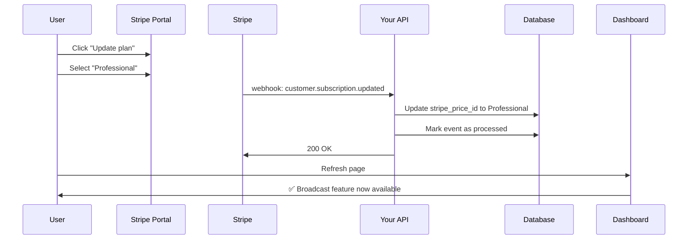
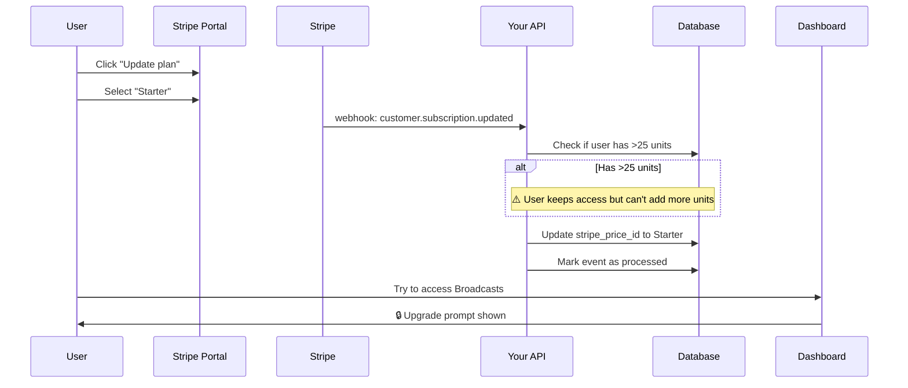
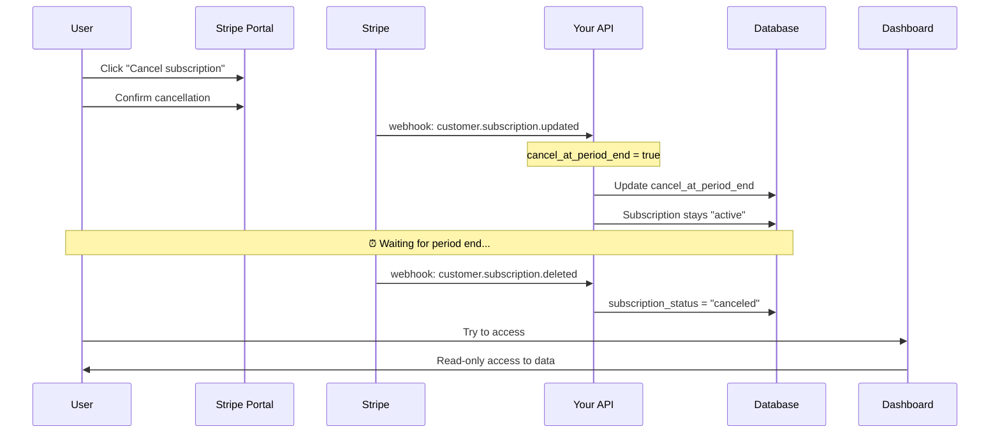
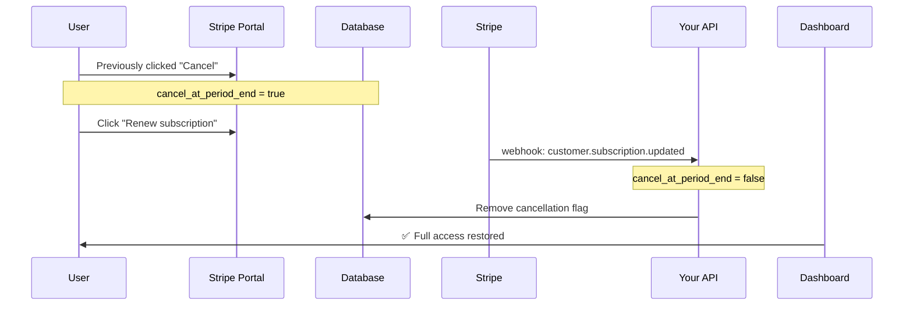
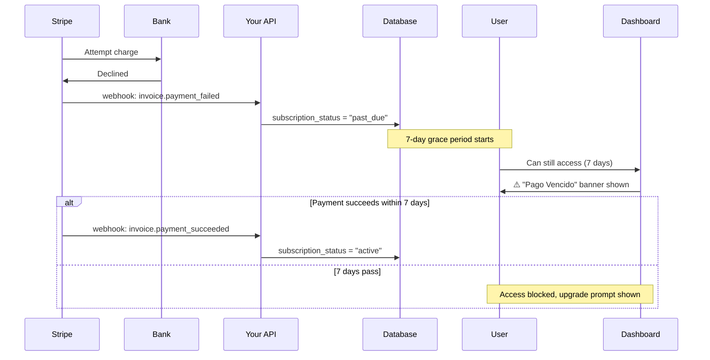

# Subscription Flow Handling Guide

## Overview

Your system is **production-ready** for handling upgrades, downgrades, and cancellations. This document explains how each scenario works.

---

## ✅ What's Implemented

### 1. **Webhook Idempotency**
- ✅ Prevents duplicate event processing (Stripe can send same event multiple times)
- ✅ Checks `subscription_events` table before processing
- ✅ Marks events as `processed` after successful handling

### 2. **Plan Change Detection**
- ✅ Logs upgrades/downgrades with old → new price IDs
- ✅ Detects reactivations (canceled subscription resumed)
- ✅ Detects scheduled cancellations (`cancel_at_period_end`)

### 3. **Grace Periods**
- ✅ **Past due**: 7-day grace period (full access)
- ✅ **Canceled**: Permanent read-only access to data
- ✅ **Incomplete/Unpaid**: 30-day read-only grace period

### 4. **Feature Gating**
- ✅ Real-time plan detection on every page load
- ✅ Automatic feature access based on `stripe_price_id`
- ✅ Server-side API protection (can't bypass via client)

---

## 🔄 Upgrade Flow

### Example: Starter ($29) → Professional ($79)



### What Happens:
1. **User actions:**
   - Opens Customer Portal via "Gestionar Suscripción" button
   - Clicks "Update plan"
   - Selects "Professional" ($79/month)
   - Confirms proration charge (immediate)

2. **Stripe processes:**
   - Creates proration invoice (credits unused Starter time, charges new Professional amount)
   - Updates subscription immediately
   - Sends `customer.subscription.updated` webhook

3. **Your system updates:**
   ```typescript
   // Webhook handler runs:
   buildings.update({
     stripe_price_id: 'price_1SHOUGB6sXQXR2eMZF3u2vc6', // Professional
     subscription_status: 'active',
     // billing dates updated
   })
   ```

4. **User experience:**
   - ✅ **Immediate access** to Professional features (Broadcasts, Analytics, etc.)
   - ✅ Page refresh shows new features unlocked
   - ✅ Unit limit increases from 25 → 75

### Proration Example:
- User upgrades 15 days into 30-day billing cycle
- Starter: $29/month = ~$0.97/day
- Professional: $79/month = ~$2.63/day
- **Credit**: 15 days × $0.97 = $14.50 (unused Starter time)
- **Charge**: 15 days × $2.63 = $39.45 (remaining Professional time)
- **Net charge**: $39.45 - $14.50 = **$24.95**

---

## 🔽 Downgrade Flow

### Example: Enterprise ($149) → Starter ($29)



### What Happens:
1. **User actions:**
   - Opens Customer Portal
   - Selects "Starter" ($29/month)
   - Confirms downgrade

2. **Stripe processes:**
   - Creates proration credit (refunds unused Enterprise time)
   - Updates subscription immediately
   - Sends `customer.subscription.updated` webhook

3. **Your system updates:**
   ```typescript
   // Webhook logs plan change:
   console.log('⚡ Plan changed from price_1SHOUGB6sXQXR2eMMjJLjJDb (Enterprise) to price_1SHOUFB6sXQXR2eMZj4vMSCj (Starter)')

   // Database updated:
   buildings.update({
     stripe_price_id: 'price_1SHOUFB6sXQXR2eMZj4vMSCj', // Starter
     subscription_status: 'active',
   })
   ```

4. **User experience:**
   - ❌ **Immediate loss** of Professional/Enterprise features
   - ✅ Can still view existing broadcasts (read-only)
   - ❌ Can't create new broadcasts
   - ⚠️ If they have 50 units, they keep them but can't add more until they upgrade

### Data Handling on Downgrade:
- **Broadcasts**: Existing ones are viewable, can't create new
- **Units**: Existing units remain, can't add beyond 25 unit limit
- **Conversations**: All messages remain accessible
- **Maintenance requests**: All remain viewable

---

## 🚫 Cancellation Flow (Scheduled)

### Default: Cancel at end of billing period



### What Happens:

#### Phase 1: User cancels (subscription still active)
1. **User actions:**
   - Opens Customer Portal
   - Clicks "Cancel subscription"
   - Confirms cancellation

2. **Stripe sends:** `customer.subscription.updated` webhook
   ```json
   {
     "status": "active",
     "cancel_at_period_end": true,
     "current_period_end": "2025-11-12T16:43:49Z"
   }
   ```

3. **Your system:**
   ```typescript
   console.log('⚠️ Subscription scheduled for cancellation at period end')

   buildings.update({
     cancel_at_period_end: true,
     subscription_status: 'active', // Still active!
   })
   ```

4. **User experience:**
   - ✅ **Full access until period end** (November 12, 2025)
   - ⚠️ Billing section shows: "Se cancela el November 12, 2025"
   - ✅ Can reactivate anytime before period end

#### Phase 2: Period ends (subscription canceled)
1. **Stripe sends:** `customer.subscription.deleted` webhook

2. **Your system:**
   ```typescript
   buildings.update({
     subscription_status: 'canceled',
     cancel_at_period_end: false,
   })
   ```

3. **User experience:**
   - ❌ Can't create/edit anything
   - ✅ **Permanent read-only access** to all their data
   - Can view: conversations, broadcasts, maintenance requests, residents
   - Can't: send messages, create broadcasts, add residents

---

## 🔄 Reactivation Flow

### User canceled but changes their mind



### What Happens:
1. **Stripe sends:** `customer.subscription.updated` webhook
   ```json
   {
     "status": "active",
     "cancel_at_period_end": false
   }
   ```

2. **Your system:**
   ```typescript
   console.log('✅ Subscription reactivated (cancellation reversed)')

   buildings.update({
     cancel_at_period_end: false,
     subscription_status: 'active',
   })
   ```

3. **User experience:**
   - ✅ Subscription continues normally
   - ✅ Full access maintained
   - ✅ Will renew automatically at period end

---

## 💳 Payment Failure Flow

### What happens when payment fails



### What Happens:
1. **Stripe sends:** `invoice.payment_failed` webhook

2. **Your system:**
   ```typescript
   buildings.update({
     subscription_status: 'past_due',
   })
   ```

3. **User experience:**
   - ✅ **7-day grace period** with full access
   - ⚠️ Red banner: "Tu pago está vencido. Por favor actualiza tu método de pago..."
   - ✅ Can update payment method in Customer Portal
   - After 7 days: ❌ Access blocked, upgrade prompt shown

4. **If payment succeeds:**
   - Stripe sends `invoice.payment_succeeded`
   - Status updates to `"active"`
   - Full access restored immediately

---

## 📊 Feature Access Matrix

| Subscription Status | Create/Edit | View Data | Features | Unit Limit |
|---------------------|-------------|-----------|----------|------------|
| **Active** | ✅ Yes | ✅ Yes | ✅ Full | ✅ Per plan |
| **Trialing** | ✅ Yes | ✅ Yes | ✅ Full | ✅ Per plan |
| **Past Due (< 7 days)** | ✅ Yes | ✅ Yes | ✅ Full | ✅ Per plan |
| **Past Due (> 7 days)** | ❌ No | ✅ Yes | ❌ Locked | ❌ No |
| **Canceled** | ❌ No | ✅ Yes (forever) | ❌ Locked | ❌ No |
| **Incomplete** | ❌ No | ✅ Yes (30 days) | ❌ Locked | ❌ No |
| **Unpaid** | ❌ No | ✅ Yes (30 days) | ❌ Locked | ❌ No |

---

## 🧪 Testing Checklist

### Test 1: Upgrade (Starter → Professional)
- [ ] Go to Settings → Billing → "Gestionar Suscripción"
- [ ] Click "Update plan" → Select Professional
- [ ] Verify immediate proration charge
- [ ] Check webhook logs for `customer.subscription.updated`
- [ ] Refresh dashboard → Broadcasts page should work (no upgrade prompt)
- [ ] Verify database: `stripe_price_id` = Professional price ID

### Test 2: Downgrade (Professional → Starter)
- [ ] In Customer Portal, switch to Starter plan
- [ ] Check webhook logs for plan change detection
- [ ] Go to Broadcasts page → should show upgrade prompt
- [ ] Try to create broadcast via API → should get 403 error
- [ ] Verify existing data still viewable

### Test 3: Cancellation (Scheduled)
- [ ] In Customer Portal, click "Cancel subscription"
- [ ] Verify webhook: `cancel_at_period_end = true`
- [ ] Billing section should show: "Se cancela el [date]"
- [ ] Full access should remain until period end
- [ ] Test reactivation: Click "Renew subscription" in portal
- [ ] Verify `cancel_at_period_end = false`

### Test 4: Payment Failure
- [ ] Use test card `4000 0000 0000 0341` (always fails)
- [ ] Webhook: `invoice.payment_failed` received
- [ ] Status updates to `past_due`
- [ ] Red banner shown in UI
- [ ] Update payment method to `4242 4242 4242 4242`
- [ ] Payment succeeds → status returns to `active`

---

## 🔍 Monitoring & Debugging

### Check Webhook Logs
```bash
# In terminal where stripe listen is running:
# Look for these events:
✅ customer.subscription.updated [200]
✅ customer.subscription.deleted [200]
✅ invoice.payment_succeeded [200]
❌ invoice.payment_failed [200]
```

### Check Database
```sql
-- Current subscription state
SELECT
  name,
  stripe_price_id,
  subscription_status,
  cancel_at_period_end,
  current_period_end
FROM buildings
WHERE id = 'your-building-id';

-- Recent webhook events
SELECT
  event_type,
  processed,
  created_at,
  event_data->>'id' as stripe_event_id
FROM subscription_events
ORDER BY created_at DESC
LIMIT 10;
```

### Check Feature Access
```typescript
// In browser console on dashboard
const subscription = {
  stripe_price_id: 'price_1SHOUFB6sXQXR2eMZj4vMSCj', // Starter
  subscription_status: 'active',
  current_period_end: new Date().toISOString(),
  cancel_at_period_end: false,
};

// Test feature check
import { checkFeatureAccess } from '@/lib/subscription';
console.log(checkFeatureAccess(subscription, 'broadcasts'));
// { hasAccess: false, currentPlan: 'STARTER', requiredPlan: 'PROFESSIONAL' }
```

---

## 🚨 Edge Cases Handled

1. **Duplicate webhooks**: ✅ Idempotency check prevents double-processing
2. **Missing buildingId metadata**: ✅ Logs error, skips update gracefully
3. **Database update fails**: ✅ Returns 500, Stripe retries webhook
4. **User has 50 units, downgrades to Starter (25 limit)**: ✅ Keeps existing units, can't add more
5. **User cancels then reactivates**: ✅ `cancel_at_period_end` updated correctly
6. **Payment fails 3 times**: ✅ 7-day grace period, then access blocked
7. **Subscription deleted while user is logged in**: ✅ Next page load shows read-only mode

---

## ✅ Summary

**Your system is production-ready!** Here's what's fully implemented:

- ✅ **Upgrades**: Immediate access to new features, proration handled
- ✅ **Downgrades**: Feature access removed immediately, existing data preserved
- ✅ **Cancellations**: Full access until period end, then read-only forever
- ✅ **Reactivations**: Seamless restoration of full access
- ✅ **Payment failures**: 7-day grace period, clear UI warnings
- ✅ **Idempotency**: No duplicate processing
- ✅ **Logging**: All plan changes detected and logged
- ✅ **Grace periods**: Smart handling of edge cases

**Ready to test in production!** 🚀
