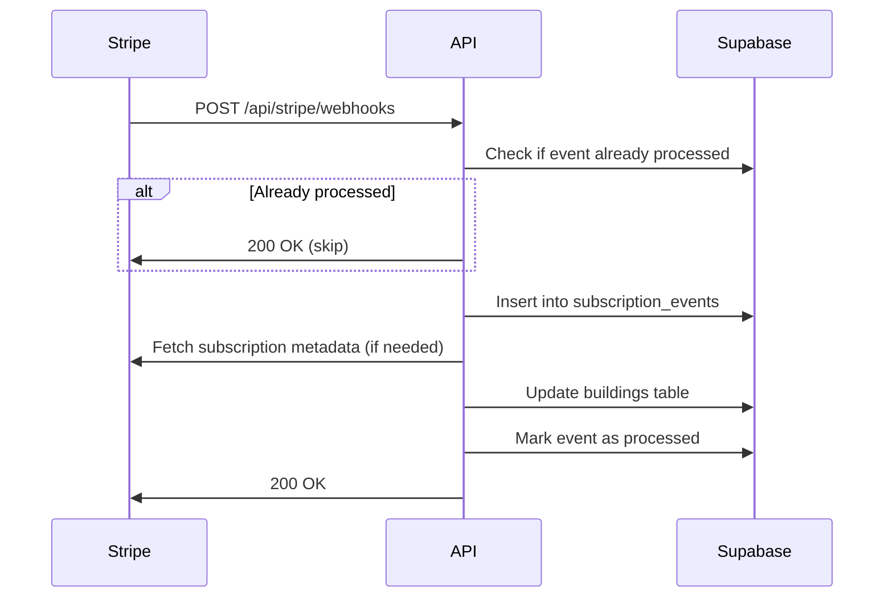

# Subscription Tracking in Supabase

## Overview

This document explains how subscription data is tracked in Supabase and how to query subscription status.

---

## Database Schema

### 1. **buildings table** (Primary subscription data)

The `buildings` table stores the **current state** of each building's subscription:

```sql
CREATE TABLE buildings (
  id UUID PRIMARY KEY,
  name TEXT,
  admin_user_id UUID REFERENCES auth.users(id),

  -- Stripe identifiers
  stripe_customer_id TEXT,           -- Stripe Customer ID (e.g., cus_xxx)
  stripe_subscription_id TEXT,       -- Current subscription ID (e.g., sub_xxx)
  stripe_price_id TEXT,              -- Current price ID (determines plan tier)

  -- Subscription status and dates
  subscription_status TEXT,          -- 'active', 'past_due', 'canceled', etc.
  current_period_start TIMESTAMPTZ,  -- Billing period start
  current_period_end TIMESTAMPTZ,    -- Billing period end (renewal date)
  cancel_at_period_end BOOLEAN,      -- True if scheduled for cancellation
  trial_ends_at TIMESTAMPTZ,         -- Trial end date (if applicable)

  created_at TIMESTAMPTZ DEFAULT NOW()
);
```

**Key Points:**
- ✅ **Single source of truth** for current subscription state
- ✅ Updated in real-time via Stripe webhooks
- ✅ `stripe_price_id` determines which plan/features the building has access to
- ✅ `subscription_status` can be: `active`, `trialing`, `past_due`, `canceled`, `incomplete`, `unpaid`

---

### 2. **subscription_events table** (Audit log)

The `subscription_events` table stores **all Stripe webhook events** for audit and debugging:

```sql
CREATE TABLE subscription_events (
  id UUID PRIMARY KEY DEFAULT gen_random_uuid(),
  stripe_event_id TEXT UNIQUE NOT NULL,  -- Stripe event ID (e.g., evt_xxx)
  event_type TEXT NOT NULL,              -- Event type (e.g., 'customer.subscription.updated')
  event_data JSONB NOT NULL,             -- Full Stripe event payload
  building_id UUID REFERENCES buildings(id), -- Associated building
  processed BOOLEAN DEFAULT FALSE,       -- Has this event been processed?
  created_at TIMESTAMPTZ DEFAULT NOW()
);
```

**Key Points:**
- ✅ **Immutable audit log** of all Stripe events
- ✅ `building_id` extracted from event metadata for easy filtering
- ✅ `processed` flag prevents duplicate event processing (idempotency)
- ✅ `event_data` stores full JSON payload for debugging

---

## How Subscription Status is Tracked

### Webhook Flow



### Event Processing

1. **Webhook receives event** from Stripe
2. **Idempotency check**: Query `subscription_events` by `stripe_event_id`
   - If exists: Return 200 (already processed)
3. **Extract buildingId**:
   - From `event.data.object.metadata.buildingId` (for subscription events)
   - Or fetch subscription to get metadata (for invoice events)
4. **Insert event**: Save to `subscription_events` with `building_id`
5. **Update buildings table**:
   - Set `stripe_subscription_id`, `stripe_price_id`, `subscription_status`, dates
6. **Mark as processed**: Set `processed = true`

---

## Querying Subscription Status

### Check if Building has Active Subscription

```sql
-- Simple check
SELECT
  subscription_status,
  current_period_end,
  cancel_at_period_end
FROM buildings
WHERE id = 'building-id';

-- Result:
-- subscription_status: 'active'
-- current_period_end: '2025-11-12 16:43:49+00'
-- cancel_at_period_end: false
```

### Use the `active_subscriptions` View

```sql
-- Get all active subscriptions with access level
SELECT * FROM active_subscriptions;

-- Result:
-- building_id | building_name | stripe_price_id | subscription_status | is_active | access_level
-- uuid        | Building ABC  | price_xxx       | active             | true      | full
-- uuid        | Building XYZ  | price_yyy       | canceled           | false     | read_only
```

### Check Access Level in Application Code

```typescript
// Server-side (src/lib/subscription-server.ts)
import { getSubscription } from '@/lib/subscription-server';

const subscription = await getSubscription();
// subscription.subscription_status: 'active' | 'past_due' | 'canceled' | etc.
// subscription.stripe_price_id: determines plan tier

// Client-side (using hook)
import { useSubscription } from '@/hooks/use-subscription';

const { isActive, currentPlan, statusDisplay } = useSubscription();
// isActive: boolean (true if user has access)
// currentPlan: 'STARTER' | 'PROFESSIONAL' | 'ENTERPRISE' | null
// statusDisplay: { text: 'Activo', variant: 'default' }
```

---

## Subscription Status Meanings

| Status | Description | Has Access? | Renews? |
|--------|-------------|-------------|---------|
| **active** | Subscription is current and paid | ✅ Yes | ✅ Yes |
| **trialing** | In trial period, not yet charged | ✅ Yes | ✅ Yes |
| **past_due** | Payment failed, in grace period (7 days) | ✅ Yes (7 days) | ⏰ Retry |
| **canceled** | Subscription ended | ❌ No (read-only) | ❌ No |
| **incomplete** | Initial payment failed | ❌ No (read-only 30 days) | ❌ No |
| **incomplete_expired** | Initial payment failed, expired | ❌ No | ❌ No |
| **unpaid** | Payment failed after retries | ❌ No (read-only 30 days) | ❌ No |

### Access Levels

Determined by `isSubscriptionActive()` and `hasReadOnlyAccess()` functions:

```typescript
// Full access (can create/edit)
subscription_status === 'active' OR 'trialing'
OR (subscription_status === 'past_due' AND within 7 days of period end)

// Read-only access (can view only)
subscription_status === 'canceled' (forever)
OR (subscription_status IN ('incomplete', 'unpaid') AND within 30 days of period end)

// Blocked (no access)
Everything else
```

---

## Indexes for Performance

The following indexes are created for fast lookups:

```sql
-- Building lookups by Stripe IDs
idx_buildings_stripe_customer_id
idx_buildings_stripe_subscription_id
idx_buildings_subscription_status

-- Event lookups
idx_subscription_events_building_id
idx_subscription_events_stripe_event_id
idx_subscription_events_processed
```

**Query Performance:**
- ✅ Find building by Stripe customer: **O(log n)** via `idx_buildings_stripe_customer_id`
- ✅ Get events for building: **O(log n)** via `idx_subscription_events_building_id`
- ✅ Idempotency check: **O(log n)** via `idx_subscription_events_stripe_event_id`

---

## Common Queries

### 1. Get current subscription for logged-in user

```sql
SELECT
  stripe_price_id,
  subscription_status,
  current_period_end,
  cancel_at_period_end
FROM buildings
WHERE admin_user_id = auth.uid();
```

### 2. Get all webhook events for a building

```sql
SELECT
  stripe_event_id,
  event_type,
  processed,
  created_at
FROM subscription_events
WHERE building_id = 'building-id'
ORDER BY created_at DESC;
```

### 3. Find buildings by plan tier

```sql
-- All Professional plan subscribers
SELECT
  b.id,
  b.name,
  b.subscription_status
FROM buildings b
WHERE b.stripe_price_id = 'price_1SHOUGB6sXQXR2eMZF3u2vc6' -- Professional
  AND b.subscription_status = 'active';
```

### 4. Get subscription event history with building info

```sql
-- Use the view
SELECT * FROM subscription_events_with_building
WHERE building_id = 'building-id'
ORDER BY created_at DESC
LIMIT 20;
```

### 5. Find subscriptions expiring soon

```sql
SELECT
  building_id,
  building_name,
  subscription_status,
  current_period_end,
  current_period_end - NOW() as days_until_renewal
FROM active_subscriptions
WHERE current_period_end BETWEEN NOW() AND NOW() + INTERVAL '7 days'
  AND subscription_status = 'active';
```

### 6. Find past_due subscriptions that need attention

```sql
SELECT
  building_id,
  building_name,
  subscription_status,
  current_period_end,
  NOW() - current_period_end as days_overdue
FROM active_subscriptions
WHERE subscription_status = 'past_due'
ORDER BY current_period_end ASC;
```

---

## Webhook Event Types We Handle

| Event | Purpose | Updates |
|-------|---------|---------|
| `checkout.session.completed` | User completed initial checkout | Creates subscription record |
| `customer.subscription.created` | Subscription created | Sets initial subscription data |
| `customer.subscription.updated` | Subscription changed (upgrade/downgrade/reactivation) | Updates plan, status, dates |
| `customer.subscription.deleted` | Subscription canceled/ended | Sets status to 'canceled' |
| `invoice.payment_succeeded` | Payment processed successfully | Sets status to 'active' |
| `invoice.payment_failed` | Payment failed | Sets status to 'past_due' |

---

## Debugging Subscription Issues

### Check if webhooks are being received

```sql
-- Recent webhook events
SELECT
  event_type,
  building_id,
  processed,
  created_at
FROM subscription_events
ORDER BY created_at DESC
LIMIT 10;
```

### Check if a specific event was processed

```sql
SELECT * FROM subscription_events
WHERE stripe_event_id = 'evt_xxxxx';
```

### Find unprocessed events

```sql
SELECT
  stripe_event_id,
  event_type,
  created_at
FROM subscription_events
WHERE processed = false
ORDER BY created_at ASC;
```

### Verify building subscription state

```sql
SELECT
  id,
  name,
  stripe_customer_id,
  stripe_subscription_id,
  stripe_price_id,
  subscription_status,
  current_period_end,
  cancel_at_period_end
FROM buildings
WHERE admin_user_id = 'user-id';
```

---

## Summary

**How we track subscriptions in Supabase:**

1. ✅ **buildings table** = Current subscription state (single source of truth)
2. ✅ **subscription_events table** = Immutable audit log of all Stripe events
3. ✅ **Webhooks** = Real-time updates from Stripe → Supabase
4. ✅ **Idempotency** = Events processed exactly once (via `stripe_event_id` unique constraint)
5. ✅ **building_id tracking** = All events linked to buildings for easy querying
6. ✅ **Views** = `active_subscriptions` and `subscription_events_with_building` for convenience
7. ✅ **Indexes** = Fast lookups by customer_id, subscription_id, status

**To check if subscription is active:**
- Query `buildings.subscription_status`
- Use `active_subscriptions` view
- Call `getSubscription()` or `useSubscription()` in code

**To audit subscription history:**
- Query `subscription_events` by `building_id`
- Use `subscription_events_with_building` view
